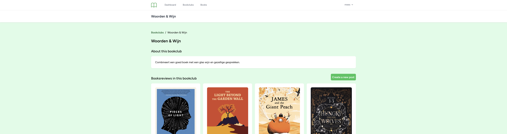

# Bookclub

## What is Bookclub?

In this assignment, I needed to set up a niche community. A niche community such as an online platform where people with a specific interest come together. This can be, for example, a forum about a particular topic, a Facebook group, or a Discord server.

I've made a platform for book lovers. The platform is called Bookclub. On this platform, users can share their favorite books with written reviews. Users can comment on each other's reviews to let each other know what they think of the book. This all is done in a safe and friendly bookclub environment.

 

## Features

- Users can create an account
- Users can log in
- Users can log out
- Users can create a review
- Users can delete their review
- Users can comment on reviews
- Users can delete their comment
- Users can view all reviews
- Users can view all comments
- Users can view all the books on the platform
- Books are available via API

 

## Tech Stack

- Laravel
- MySQL
- Tailwind CSS
- Blade
- PHP
- HTML
- Mailing
- Seeding via Factories and Faker
- Filament (for admin panel)
- Pagination
- CRON jobs
- SEO optimization

 

## License
This project is distributed under the [MIT License](LICENSE).

## Contact
If you have any questions or need further assistance, please feel free to contact me on LinkedIn or Instagram.

